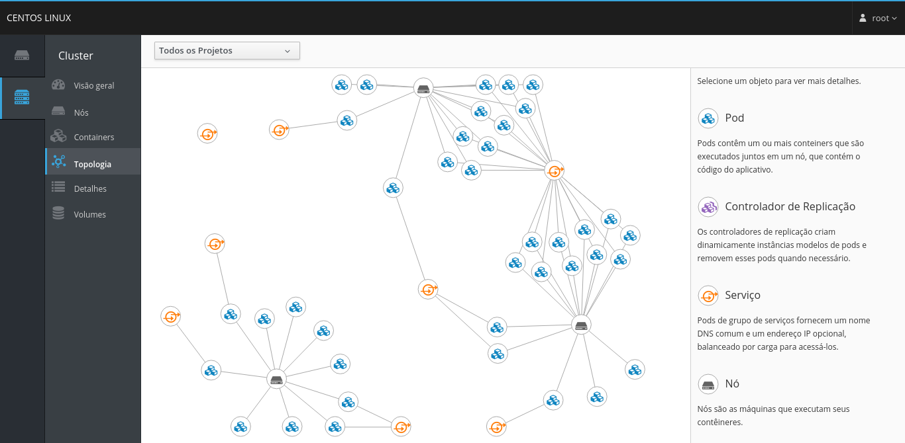
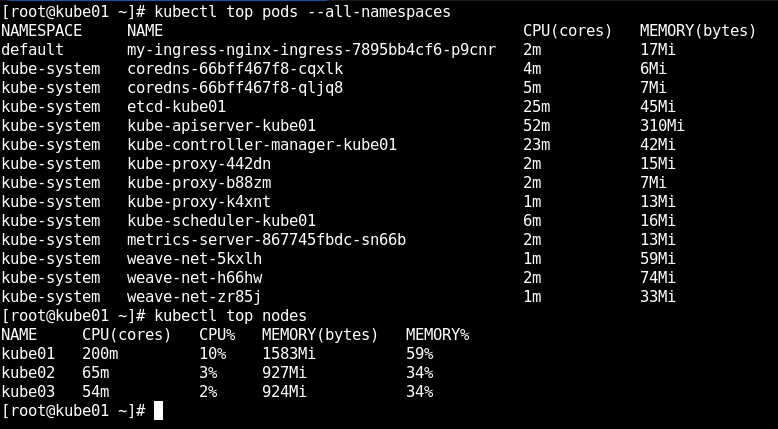
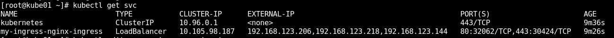

# Install kubernetes with ansible playbooks on CENTOS7-Minimal

## Ajuste as variáveis no arquivo hosts

##### Coloque o endereço IP do node master do cluster

> K8S_MASTER_NODE_IP= [ endereço ip do master ] 

##### Escolha True ou False para instalar alguns serviços no cluster

Instala o serviço de métricas do cluster kubernetes

> INSTALL_METRICS=True

Instala o serviço do INGRESS do NGINX no cluster kubernetes

> INSTALL_INGRESS=True

Instala o DASHBOAD do cluster kubernetes

> INSTALL_DASBOARD=True

Instala o Grafana e Prometheus no cluster kubernetes para monitoramento do NGINX

> INSTALL_MONITORING=True

## Instalação

- ansible-playbook -i hosts main.yml

## Ajuste no metritcs

Edite o deployment do metrics que fina no namespace kube-system

> kubectl -n kube-system edit deployments metrics-server

	spec:
      containers:
        command:
          - /metrics-server
          - --metric-resolution=5s
          - --kubelet-preferred-address-types=InternalIP
          - --kubelet-insecure-tls

> kubectl top nodes
> kubectl top pods

## Ajuste no nginx 

Coloque os endereços IPv4 que devem responder pelo acesso aos serviços internos do cluster

> kubectl get svc

> kubectl -n ingress-nginx edit svc my-ingress-nginx-ingress

	spec:
	  externalIPs:
	    - 192.168.123.206
	    - 192.168.123.218
	    - 192.168.123.144

> kubectl get svc

# Documentação

- [Kubernetes](https://kubernetes.io/pt/docs/home/)
- [Documentação](https://docs.ansible.com/ansible/latest/index.html)
- [Github](https://github.com/ansible/ansible)
- [NGINX](https://github.com/kubernetes/ingress-nginx)
- [HELM instalação](https://docs.nginx.com/nginx-ingress-controller/installation/installation-with-helm/)
- [HELM](https://helm.sh/docs/)
- [Web UI (Dashboard)](https://kubernetes.io/docs/tasks/access-application-cluster/web-ui-dashboard/)
- [Monitoramento NGINX](https://kubernetes.github.io/ingress-nginx/user-guide/monitoring/#grafana)
- [CertManager.io](https://cert-manager.io/docs/installation/kubernetes/)