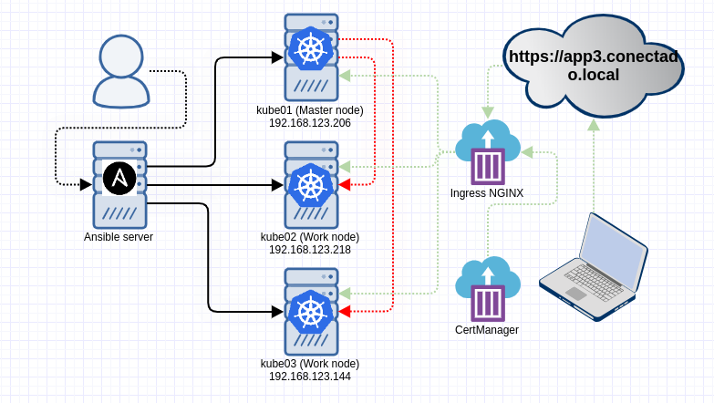

# Install kubernetes with ansible playbooks on CENTOS7-Minimal

- Ajuste as variáveis no arquivo hosts

	<code>
	K8S_MASTER_NODE_IP= [ endereço ip do master ] 
	</code>

- ansible-playbook -i hosts main.yml

## Ajuste no metritcs

Edite o deployment do metrics que fina no namespace kube-system

> kubectl -n kube-system edit deployments metrics-server

	spec:
      containers:
        command:
          - /metrics-server
          - --metric-resolution=5s
          - --kubelet-preferred-address-types=InternalIP
          - --kubelet-insecure-tls

> kubectl top nodes
> kubectl top pods

## Ajuste no nginx 

Coloque os endereços IPv4 que devem responder pelo acesso aos serviços internos do cluster

> kubectl get svc

	spec:
	  externalIPs:
	    - 192.168.123.206
	    - 192.168.123.218
	    - 192.168.123.144

> kubectl get svc
